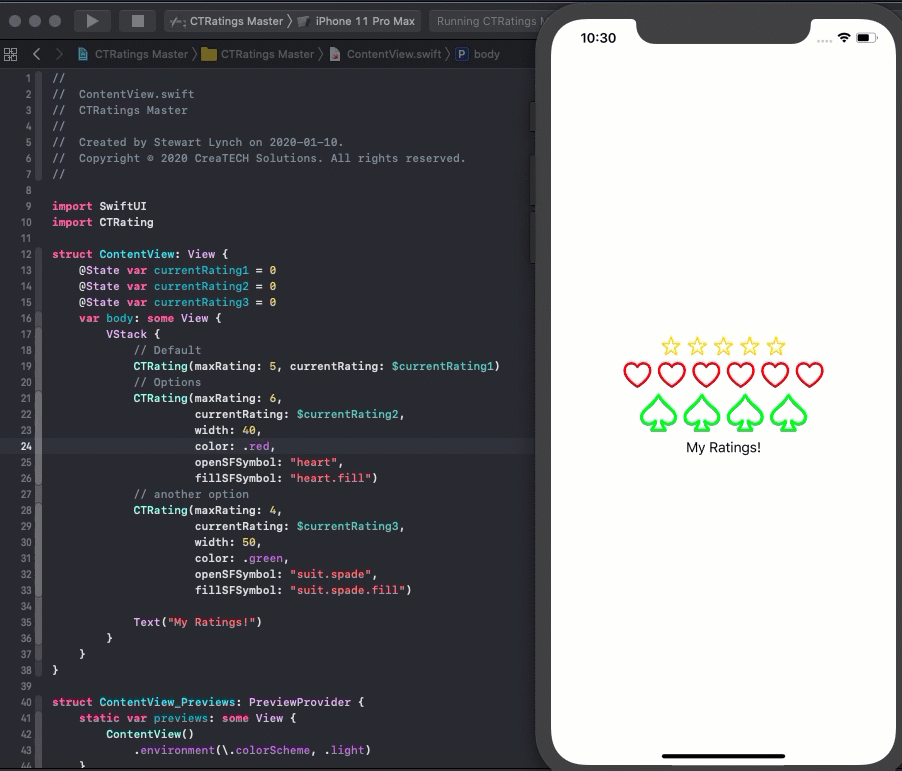

# CTRating

[](https://developer.apple.com/iphone/index.action)[](https://developer.apple.com/swift)

### What is this?



**CTRating** is a  SwiftUI rating view that can be added to any SwiftUI view.  It is customizable and provides you with a way to add a ratings component to your project.

The above example shows three different CTRating views added to a VStack.  Each one with a different configuration and controlled independently.

### YouTube Tutorial Video

This SwiftPackage was developed to demonstrate how to create a Swift package and submit it to a remote for use with Swift Package Manager.

The full turorial is available along with the starter project at

https://www.youtube.com/watch?v=al2O8uCFD4E

### Requirements

- iOS 13.0+
- Xcode 11.0+
- SwiftUI

### Installation

1. From within Xcode 11 or later, choose **File > Swift Packages > Add Package Dependency**
2. At the next screen enter https://github.com/StewartLynch/CTRating when asked to choose a Package repository
3. Choose the latest available version.
4. Add the package to your target.

### Import CTRating

In the View where you are going to implement `CTRating` , type

```swift
import CTRating
```

### Setup

CTRating is very easy to set up.  Each rating component you add, requires a state variable that will increment or decrement as the user taps on one of the rating symbols

You would normally start by setting the default value to 0

```swift
@State var currentRating = 0
```

### Parameters

If you implement CTRating with the two default parameters, you will be presented with a rating control that uses a yellow star symbol.  The number of stars is defined by the number you enter for `maxRating` and the value that will be updated is the state variable that you have defined for the control.  The default width will be 30 pts each.

```swift
CTRating(maxRating: 5, currentRating: $currentRating)
```


### Customization

You can customize the control by changing `maxRating` (number of symbols) as well as the `width`, `color` and two images ( `openSFSymbol` and `fillSFSymbol` ) that are used for your open and filled symbols.  The image symbol names are strings that correspond to an **SF Symbol**.

Here is an example of a larger, 6 red heart control

```swift
CTRating(maxRating: 6,
         currentRating: $currentRating,
         width: 40,
         color: .red,
         openSFSymbol: "heart",
         fillSFSymbol: "heart.fill")
```


